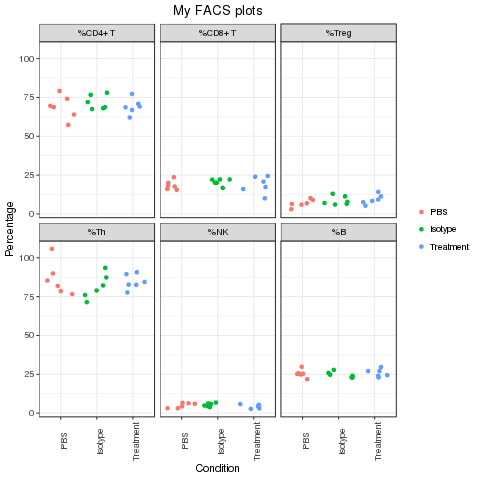

## Challenge

You've run a FACS experiment and you need to calculate percentages of the cell types you've measured and visualise the data. You can do it in Excel but it's becoming very tedious and error-prone because you have several experiments you need to analyse. So instead, try to use what you've learnt about R and the tidyverse to analyse and visualise the data.

The aim of this challenge is to generate a PDF containing plots that look similar to below. Feel free to choose different colours and add any other modifications that you think makes it look better.

### Steps

* Read in the Excel file called facs_example_data.xlsx, save it as an object called facs. Hint: use library(readxl) and Google to find the function to read in an excel file.
* How many rows and columns are in the file?
* Remove the rows containing the test samples (Test-1, Test-2 and Test-3). Hint: use filter and !str_detect (! means not)
* Add a column called Group containing a value for whether the Sample is Isotype, PBS or Treatment. Hint: use case_when and str_detect
* Add a column called "%CD4+ T" that contains the CD4T column value as a percent of the T_Cells column for each sample. Note you will need to quote the name of the column as it contains a symbol (%) and a space.
* Add more columns that have the name given under Column below, containing values that are calculations of cell percentages from the named columns (similar to what you did for "%CD4+ T")
    **Column**    Value  
    **"%CD8+ T"**           CD8T as percent of T_Cells  
    **"%Treg"**             Treg as percent of CD4T  
    **"%Th"**               Th as percent of CD4T  
    **"%B"**                B as percent of CD45.1  
    **"%NK"**               NK as percent of CD45.1  
* Make jitter plots of the values for the groups. Hints: 
    1. First convert values to long format with gather, call the key column Cell and the value column Value. 
    2. Then make jitter plots with Group on the x axis and Value on the y axis. 
    3. Facet by the Cell column to get plots for each cell percentage
* Colour by sample. Bonus if you use colour-blind friendly colours. Hint: Google
* Change the plot to colour the groups. 
* Order the groups along the x axis (and legend) as PBS, Isotype, Treatment. Hint: use factor and levels
* Order the jitter plots as "%CD4+ T", "%CD8+ T", "%Treg", "%Th", "%NK", "%B". Hint: use factor and levels
* Change the X axis label to Condition
* Change the Y axis label to Percentage
* Remove the grey background. Use any theme you like.
* Make the x axis labels vertical
* Remove the legend title
* Add a title called "My FACS plots"
* Centre the title
* Save the plot as a PDF called my_facs_plots.pdf
* Save the table used to make the plot as a file (it must contain the % columns and can also contain other columns) as a tab-separated file called "facs_analysis.tsv". Hint: see the write_tsv function.
* Read in the FACS file from a second experiment that uses the same markers and number of samples. Make a pdf of plots similer to the first experiment. Save it as facs_plot_expt2.pdf. Hint: Simply adapt the code you've written for the first experiment.
