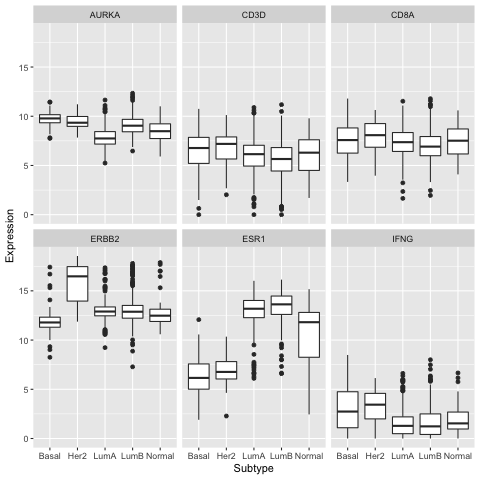

#### Acknowledgements
Thanks to Anna Trigos and Franco Caramia for suggestions for this challenge.

## Challenge

You've been working with RNA-seq samples from mouse mammary gland basal and luminal cells, to try to better understand breast cancer. Now you want to check the expression of some genes in *human* basal and luminal breast cancer samples. You decide to use the [TCGA breast cancer](https://www.nature.com/articles/nature11412) dataset as it has many (hundreds) of samples and the RNA-seq counts are available to download.

The aim of this challenge is to generate boxplots of RNA-seq expression for several genes, similar to below. The subtypes (e.g. basal, luminal) have been added to the counts file and it has been formatted and subsetted for you. Feel free to choose different colours and add any other modifications that you think makes it look better. 

### Steps

* Read in the file called `tcga_rna.tsv.gz`, save it as an object called exp.
* First make a boxplot for the ESR1 gene (estrogen receptor). Plot the subtypes (PAM50 column) on the X axis and the RNA-seq counts (Value column) on the y. Hint: use filter.
* Then make boxplots for the genes ESR1, ERBB2, CD8A, CD3D, AURKA, INFG. Hint: use facet_wrap
* Remove the NA on the x axis and legend. Hint: use drop_na.
* Change the X axis label to Subtype and the Y axis to Expression. 
* Save the boxplots as a PDF called `TCGA_boxplots.pdf`.
* Email the instructor your PDF and code.
