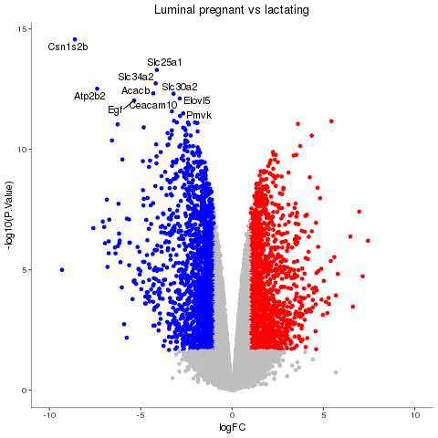

## Course Description
This course provides an introduction to the R programming language through the tidyverse. 
A variety of plots will be taught using RNA-seq data from a published paper.

## Course Objectives

After this course you should be able to:

* Import data and plot graphs with ggplot2
* Create a documented and reproducible piece of R code

## Topics Covered

### Week 1
- Creating bar plots, density plots, box pots, violin plots

### Week 2
- Creating volcano plots

### Week 3
- Creating stripcharts using faceting

### Week 4
- Practice

## Course Materials

### Week 1
- [Introduction](https://pmacdasci.github.io/r-intro-tidyverse/introduction.html)
- [First plots](https://pmacdasci.github.io/r-intro-tidyverse/firstplots.html)

### Week 2
- [Volcano plots](https://pmacdasci.github.io/r-intro-tidyverse/volcanoplot.html)

### Week 3
- [Stripcharts](https://mblue9.github.io/r-intro-tidyverse/stripcharts.html)

### Week 4
- [TCGA challenge](https://mblue9.github.io/r-intro-tidyverse/challenges/tcga_challenge.html)
- [Interactive volcano plot challenge](https://mblue9.github.io/r-intro-tidyverse/challenges/interactive_volcanoplot_challenge.html)
- [REDCAP challenge](https://mblue9.github.io/r-intro-tidyverse/challenges/redcap_challenge.html)
- [FACS challenge](https://mblue9.github.io/r-intro-tidyverse/challenges/facs_challenge.html)

### Course Cheatsheet
- [Cheatsheet](https://mblue9.github.io/r-intro-tidyverse/cheatsheet.html)

## Acknowledgements
This course is run by the Peter Mac Data Science Training team.

## Useful Resources
[The ggplot2 cheatsheet](https://github.com/rstudio/cheatsheets/raw/master/data-visualization-2.1.pdf)  
[base R cheatsheet](https://www.rstudio.com/wp-content/uploads/2016/05/base-r.pdf)  
[Data Manipulation and Visualisation](http://bioinformatics-core-shared-training.github.io/r-intermediate/) by University of Cambridge  
[An Introduction to ggplot](https://www.bioinformatics.babraham.ac.uk/training.html#ggplot) by Babraham Bioinformatics  
[An intro to R and tidyverse](https://monashdatafluency.github.io/r-intro-2/) by Monash Bioinformatics Platform
