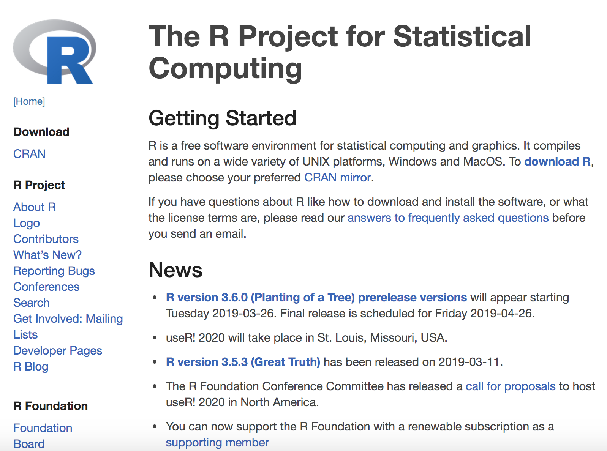
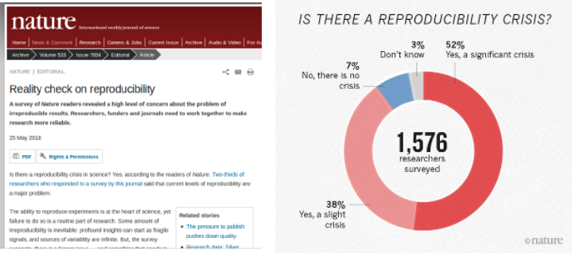
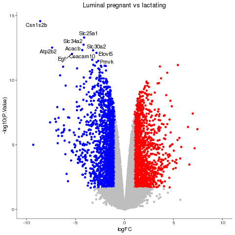
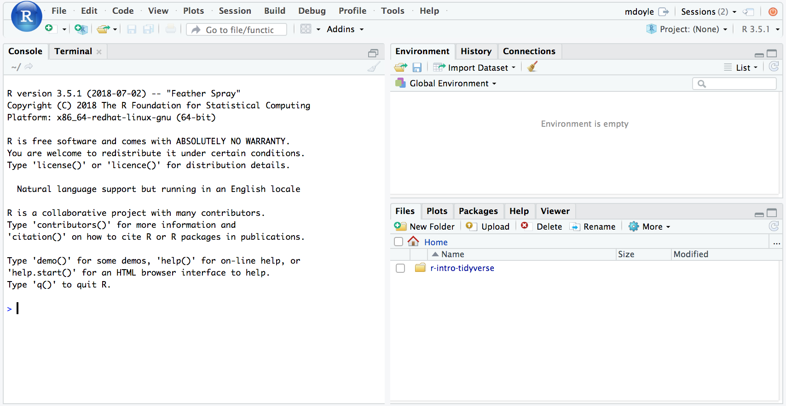
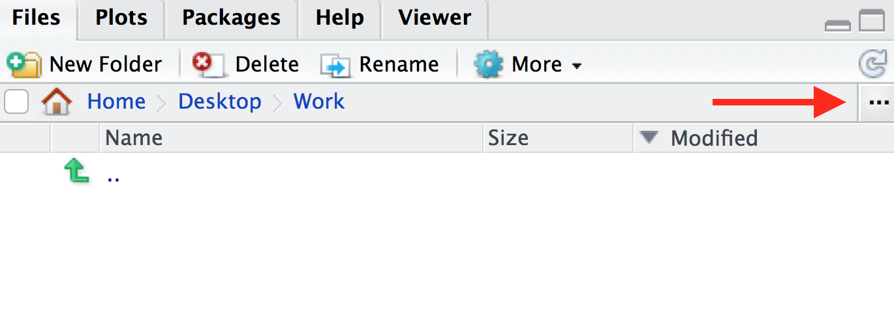
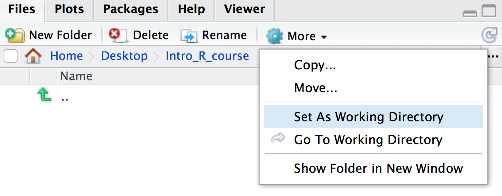
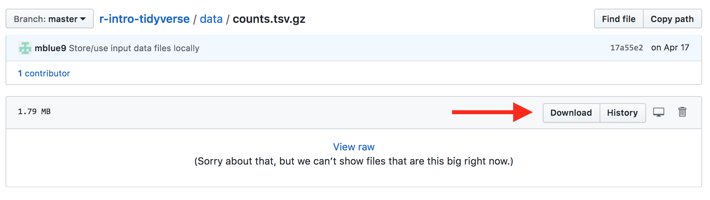

\  
\  

#### Acknowledgements
Peter Mac Data Science's remix of material from [CRUK Cambridge](https://github.com/bioinformatics-core-shared-training), [The Carpentries](https://carpentries.org/),  [Monash Bioinformatics Platform](https://monashdatafluency.github.io/r-intro-2/index.html) and [Lucy Liu](https://lucyleeow.github.io/BaseR_Intro).

\  
\  
\  

##Why not just use Excel?
Spreadsheets are a common entry point for many types of analysis and Excel is used widely but 

* can be unwieldy and difficult to deal with large amounts of data
* error prone (e.g. gene symbols turning into dates)
* tedious and time consuming to repeatedly process multiple files
* **how can you, or someone else, repeat what you did several months or years down the line?**

\  
\  
\  

##What is R?

* A statistical programming environment suited to high-level data analysis
* But offers much more than just statistics
* Open source and cross platform
* Extensive graphics capabilities
* Diverse range of add-on packages
* Active community of developers
* Thorough documentation


http://www.r-project.org/



\  
\  
\  

##Who uses R? Not just academics!

\  
\  
\  


http://www.revolutionanalytics.com/companies-using-r

- Facebook
    + http://blog.revolutionanalytics.com/2010/12/analysis-of-facebook-status-updates.html
- Google
    + http://blog.revolutionanalytics.com/2009/05/google-using-r-to-analyze-effectiveness-of-tv-ads.html
- Microsoft
    + http://blog.revolutionanalytics.com/2014/05/microsoft-uses-r-for-xbox-matchmaking.html
- New York Times
    + http://blog.revolutionanalytics.com/2011/03/how-the-new-york-times-uses-r-for-data-visualization.html
- Buzzfeed
    + http://blog.revolutionanalytics.com/2015/12/buzzfeed-uses-r-for-data-journalism.html
- New Zealand Tourist Board
    + https://mbienz.shinyapps.io/tourism_dashboard_prod/

\  
\  
\  
    
## R can facilitate Reproducible Research


- Statisticians at MD Anderson tried to reproduce results from a Duke paper and unintentionally unravelled a web of incompetence and skullduggery as reported in the ***New York Times***
    


- Very entertaining talk from Keith Baggerly in Cambridge, December 2010

<iframe width="560" height="315" src="https://www.youtube.com/embed/7gYIs7uYbMo" frameborder="0" allowfullscreen></iframe>

According to recent editorials, the reproducibility crisis is still on-going



[Challenges in irreproducible research](https://www.nature.com/collections/prbfkwmwvz)

[Reality check on reproducibility](http://www.nature.com/news/reality-check-on-reproducibility-1.19961)

[1,500 scientists lift the lid on reproducibility](http://www.nature.com/news/1-500-scientists-lift-the-lid-on-reproducibility-1.19970)

\  
\  
\  

##R plotting capabilities

R enables making **complex, publication-quality, reproducible** plots. An example of one of the plots we will make in this course is shown below.



\  
\  
\  

##Getting started
- In this course we can use a server that has everything already installed for you or you can use your own laptop.
- If you want to install on your own computer you can get the latest release of R from https://www.r-project.org/
    + Base package and Contributed packages (general purpose extras)
    + `r length(XML:::readHTMLTable("http://cran.r-project.org/web/packages/available_packages_by_date.html")[[1]][[2]])` available packages as of `r date()`
- Download from https://cran.rstudio.com/
- Windows, Mac and Linux versions available
- Executed using command line, or a graphical user interface (GUI)
- On this course, we use the RStudio GUI (www.rstudio.com)

 

\  
\  
\  

## Introduction to RStudio

Throughout this lesson, we'll be using RStudio: a free, open source R integrated development
environment. It provides a built in editor, works on all platforms (including
on servers) and provides many advantages such as integration with version
control and project management.

You can think of R as the engine in a car and RStudio as the body & controls. R is doing all the calculations/computations but RStudio makes it easier for you to use R.


**Basic layout**

When you first open RStudio, you will be greeted by three panels:




* Left panel: this panel features two tabs, ‘Console’, which is where you can type in commands for R to run and ‘Terminal’, which we won’t worry about in this course.
* Top right panel:
    * Environment - in this tab you can see all variables you have created.
    * History - R keeps track of all commands you have run and you can review them in this tab.
    * Connections - this tab helps you connect to data sources but we will not be using it in this course.
* Bottom right:
    * Files - you can explore your file directory here
    * Plots - plots that you create will either appear here or be saved to a file.
    * Help - help files for R functions can be viewed in this tab. Help files tell you about what a function does and how to use it.
    * Packages - basic R includes many useful functions. You can add even more functions by downloading packages. A package is a collection of functions, generally with a certain data analysis theme. For example, the package 'tidyverse', which we will use later, includes functions designed for visualising data.
    * Viewer - this tab lets you view local web content but we won’t be using it in this course.


Once you open files, such as R scripts, an editor panel will also open
in the top left, as shown below.


\  
\  
\  

## Workflow within RStudio

### Console vs Script

There are two main ways one can work within RStudio.

 1. Test and play within the interactive R **console** then copy code into
a .R file to run later.
    *  This works well when doing small tests and initially starting off.
    *  It quickly becomes laborious
 2. Start writing in a **script** (a .R file) and use RStudio's short cut keys for the Run command
to push the current line, selected lines or modified lines to the
interactive R console.
    * This is a great way to start; all your code is saved for later
    * You will be able to run the file you create from within RStudio
   or using R's `source()`  function.
   
We will use the second way in this course.

Let's open a new R script, go to `File > New File > R Script`.
In the script you opened type the following.

```{r, eval=FALSE}
1 + 1
```

### Running segments of your code

RStudio offers you great flexibility in running code from within the editor
window. There are buttons, menu choices, and keyboard shortcuts. To run the
current line, you can 

1. click on the `Run` button above the editor panel, or 
2. select "Run Lines" from the "Code" menu, or 
3. hit <kbd>Ctrl</kbd>+<kbd>Return</kbd> in Windows or Linux 
or <kbd>&#8984;</kbd>+<kbd>Return</kbd> on OS X.
(This shortcut can also be seen by hovering
the mouse over the button). To run a block of code, select it and then `Run`.
If you have modified a line of code within a block of code you have just run,
there is no need to reselect the section and `Run`, you can use the next button
along, `Re-run the previous region`. This will run the previous code block
including the modifications you have made.

Try running the command you typed above (`1 + 1`) using the `Run` button and also the shortcut keys (Ctrl/Cmd and Return).

Note how the output appears in the console. The console window is the place where R is waiting for you to tell it what to do, and where it will show the results of a command. `>` means that R is ready to take a command. `+` means the command is not complete, such as you are missing a `)`. You can type commands directly into the console, but they will be forgotten when you close the session. The script is a simple text (.R) file that stores your code. The point of a well constructed script is not just to “do stuff” but to do it in a way that maintains a complete record of your work so anyone can easily and exactly replicate your workflow and results.

### Comments

The comment character in R is `#`, anything to the right of a `#` in a script
will be ignored by R. It is useful to leave notes, and explanations in your
scripts.
RStudio makes it easy to comment or uncomment a paragraph: after selecting the
lines you  want to comment, press at the same time on your keyboard
<kbd>Ctrl</kbd> + <kbd>Shift</kbd> + <kbd>C</kbd>. If you only want to comment
out one line, you can put the cursor at any location of that line (i.e. no need 
to select the whole line), then press <kbd>Ctrl</kbd> + <kbd>Shift</kbd> + 
<kbd>C</kbd>.

Insert a comment into your script such as below.
```{r, eval=FALSE}
# This is my script
1 + 1
```

### Working directory
Every file on your computer is located in a specific location. This location can be referred to by a path. In Mac, paths look something like this: `/Users/doylemaria/Documents/`. In Windows, paths look something like this: `C:\Users\doylemaria\Documents\`.

When you open a R session, it launches from a specific location. You can find out where this is using the command `getwd()`. This location called the ‘working directory’. R will, by default, look in this directory when reading in data and write out files/plots to this directory. It is often useful to have your data and R Scripts in the same directory and set this as your working directory.

You can set your working directory to be anywhere you like and we will now do this:

Make a folder for this course, somewhere sensible on your computer that you will be able to easily find. Name the folder for example, "Intro_R_course".

Go back to your RStudio window, go to the bottom right panel, click on the ‘Files’ tab and then click on the three dots on the top right hand corner, as shown below.



This will open up a new window which lets you explore the files and folders on your computer. Find the new folder you created, click on it, then click ‘Open’.

The files tab will now show the contents of your new folder (which should be empty). At the top of the files tab, click on `More > Set As Working Directory`, as shown below.



Please set your working directory to be this folder at the start of EVERY session.


### Data files
The data files required for this workshop are available on [GitHub](https://github.com/PMacDaSci/r-intro-tidyverse/tree/master/data). To download a data file, click on the file you wish to download then click 'Download', as shown below (or if it is an uncompressed file, right click 'Raw' > 'Save Link As…'). Alternatively, the files may have been provided to you by the instructor. 

Store these input files in your working directory in a folder called `data`.


