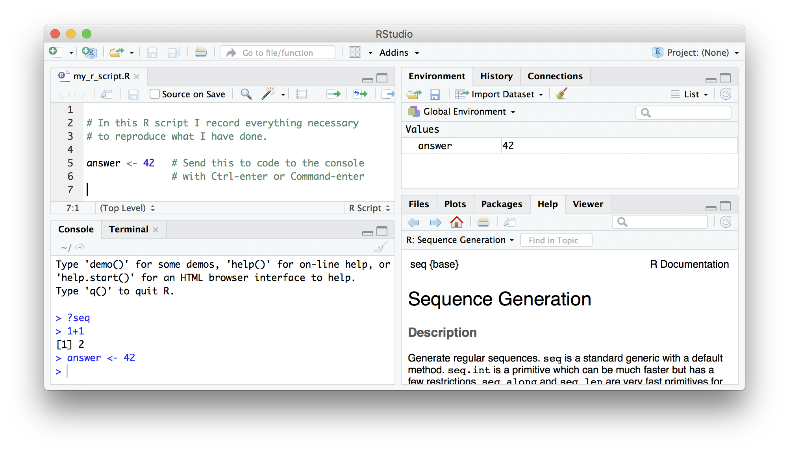

\  
\  

#### Acknowledgements
Peter Mac Data Science's remix of material from [CRUK Cambridge](https://github.com/bioinformatics-core-shared-training), [The Carpentries](https://carpentries.org/) and [Monash Bioinformatics Platform](https://monashdatafluency.github.io/r-intro-2/index.html)

##Why not just use Excel?
Spreadsheets are a common entry point for many types of analysis and Excel is used widely but 

* can be unwieldy and difficult to deal with large amounts of data
* error prone (e.g. gene symbols turning into dates)
* tedious and time consuming to repeatedly process multiple files
* **how can you, or someone else, repeat what you did several months or years down the line?**

##What is R?

* A statistical programming environment suited to high-level data analysis
* But offers much more than just statistics
* Open source and cross platform
* Extensive graphics capabilities
* Diverse range of add-on packages
* Active community of developers
* Thorough documentation

http://www.r-project.org/

\  
\  

##Who uses R? Not just academics!
\  
\  

http://www.revolutionanalytics.com/companies-using-r

- Facebook
    + http://blog.revolutionanalytics.com/2010/12/analysis-of-facebook-status-updates.html
- Google
    + http://blog.revolutionanalytics.com/2009/05/google-using-r-to-analyze-effectiveness-of-tv-ads.html
- Microsoft
    + http://blog.revolutionanalytics.com/2014/05/microsoft-uses-r-for-xbox-matchmaking.html
- New York Times
    + http://blog.revolutionanalytics.com/2011/03/how-the-new-york-times-uses-r-for-data-visualization.html
- Buzzfeed
    + http://blog.revolutionanalytics.com/2015/12/buzzfeed-uses-r-for-data-journalism.html
- New Zealand Tourist Board
    + https://mbienz.shinyapps.io/tourism_dashboard_prod/
\  
\  
    
## R can facilitate Reproducible Research

- Statisticians at MD Anderson tried to reproduce results from a Duke paper and unintentionally unravelled a web of incompetence and skullduggery
    + as reported in the ***New York Times***
    

- Very entertaining talk from Keith Baggerly in Cambridge, December 2010

<iframe width="560" height="315" src="https://www.youtube.com/embed/7gYIs7uYbMo" frameborder="0" allowfullscreen></iframe>

According to recent editorials, the reproducibility crisis is still on-going

[Challenges in irreproducible research](https://www.nature.com/collections/prbfkwmwvz)

[Reality check on reproducibility](http://www.nature.com/news/reality-check-on-reproducibility-1.19961)

[1,500 scientists lift the lid on reproducibility](http://www.nature.com/news/1-500-scientists-lift-the-lid-on-reproducibility-1.19970)

##R plotting capabilities

R enables making **complex, publication-quality, reproducible** plots. An example of one of the plots we will make in this course is shown below.

\  
\  

##Getting started
- In this course we use a server that has everything already installed for you.
- If you want to install on your own computer you can get the latest release of R from https://www.r-project.org/
    + Base package and Contributed packages (general purpose extras)
    + `r length(XML:::readHTMLTable("http://cran.r-project.org/web/packages/available_packages_by_date.html")[[1]][[2]])` available packages as of `r date()`
- Download from https://cran.rstudio.com/
- Windows, Mac and Linux versions available
- Executed using command line, or a graphical user interface (GUI)
- On this course, we use the RStudio GUI (www.rstudio.com)

 
\  
\  
    
## Introduction to RStudio

Throughout this lesson, we'll be using RStudio: a free, open source R integrated development
environment. It provides a built in editor, works on all platforms (including
on servers) and provides many advantages such as integration with version
control and project management.

**Basic layout**

When you first open RStudio, you will be greeted by three panels:

  * The interactive R console (entire left)
  * Environment/History (tabbed in upper right)
  * Files/Plots/Packages/Help/Viewer (tabbed in lower right)

Once you open files, such as R scripts, an editor panel will also open
in the top left.

\  
\  

## Workflow within RStudio
There are two main ways one can work within RStudio.

1. Test and play within the interactive R **console** then copy code into
a .R file to run later.
   *  This works well when doing small tests and initially starting off.
   *  It quickly becomes laborious
2. Start writing in a **script** (a .R file) and use RStudio's short cut keys for the Run command
to push the current line, selected lines or modified lines to the
interactive R console.
   * This is a great way to start; all your code is saved for later
   * You will be able to run the file you create from within RStudio
   or using R's `source()`  function.
   
The console window is the place where R is waiting for you to tell it what to do, and where it will show the results of a command. `>` means that R is ready to take a command. `+` means the command is not complete, such as you are missing a `)`. You can type commands directly into the console, but they will be forgotten when you close the session. The script is a simple text (.R) file that stores your code. The point of a well constructed script is not just to “do stuff” but to do it in a way that maintains a complete record of your work so anyone can easily and exactly replicate your workflow and results.
   
We will use the second way in this course.

### Tip: Running segments of your code

RStudio offers you great flexibility in running code from within the editor
window. There are buttons, menu choices, and keyboard shortcuts. To run the
current line, you can 
1. click on the `Run` button above the editor panel, or 
2. select "Run Lines" from the "Code" menu, or 
3. hit <kbd>Ctrl</kbd>+<kbd>Return</kbd> in Windows or Linux 
or <kbd>&#8984;</kbd>+<kbd>Return</kbd> on OS X.
(This shortcut can also be seen by hovering
the mouse over the button). To run a block of code, select it and then `Run`.
If you have modified a line of code within a block of code you have just run,
there is no need to reselct the section and `Run`, you can use the next button
along, `Re-run the previous region`. This will run the previous code block
including the modifications you have made.

### Comments

The comment character in R is `#`, anything to the right of a `#` in a script
will be ignored by R. It is useful to leave notes, and explanations in your
scripts.
RStudio makes it easy to comment or uncomment a paragraph: after selecting the
lines you  want to comment, press at the same time on your keyboard
<kbd>Ctrl</kbd> + <kbd>Shift</kbd> + <kbd>C</kbd>. If you only want to comment
out one line, you can put the cursor at any location of that line (i.e. no need 
to select the whole line), then press <kbd>Ctrl</kbd> + <kbd>Shift</kbd> + 
<kbd>C</kbd>.
